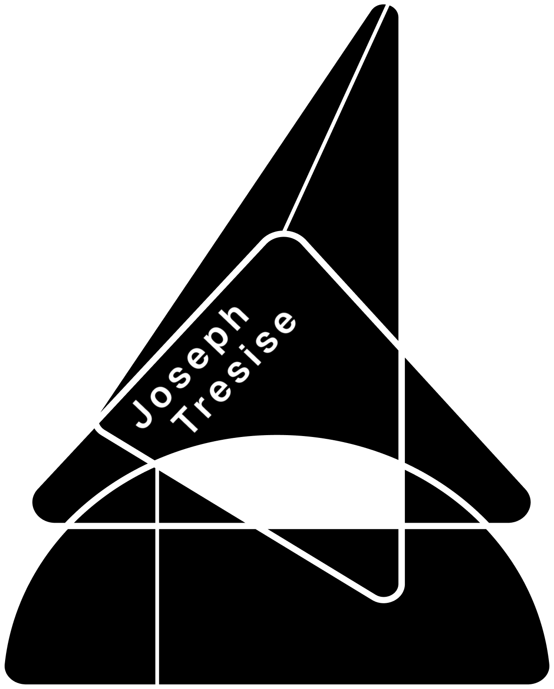

# Python Scratch Repo

[](https://opensource.org/licenses/MIT)
[](#)
[](#)
[](#)
[](#)

This is a Python learning repo.

## Installation

Use the package manager [uv](https://docs.astral.sh/uv/) to get started. We have numerous dependency groups within our `pyproject.toml` so use the following command to install the correct group:

```bash
uv sync --frozen --group <group_name>
```
> NOTE: Each `NOTES.MD` should inform you what group to install

## Table of Contents

[Pydantic V2](./scripts/pydantic//pydantic-NOTES.MD)
